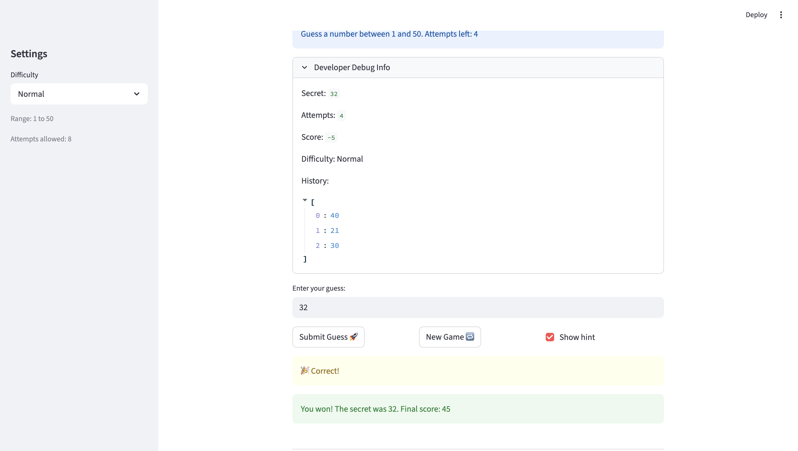

# 🎮 Game Glitch Investigator: The Impossible Guesser

## 🚨 The Situation

You asked an AI to build a simple "Number Guessing Game" using Streamlit.
It wrote the code, ran away, and now the game is unplayable. 

- You can't win.
- The hints lie to you.
- The secret number seems to have commitment issues.

## 🛠️ Setup

1. Install dependencies: `pip install -r requirements.txt`
2. Run the broken app: `python -m streamlit run app.py`

## 🕵️‍♂️ Your Mission

1. **Play the game.** Open the "Developer Debug Info" tab in the app to see the secret number. Try to win.
2. **Find the State Bug.** Why does the secret number change every time you click "Submit"? Ask ChatGPT: *"How do I keep a variable from resetting in Streamlit when I click a button?"*
3. **Fix the Logic.** The hints ("Higher/Lower") are wrong. Fix them.
4. **Refactor & Test.** - Move the logic into `logic_utils.py`.
   - Run `pytest` in your terminal.
   - Keep fixing until all tests pass!

## 📝 Document Your Experience

- PURPOSE: It's a number guessing game where you try to guess a secret number within a limited number of attempts. You pick a difficulty (Easy, Normal, Hard) which sets the range and attempt limit, then type guesses and get hints telling you to go higher or lower. You earn points for winning (more points if you guess in fewer attempts) and lose points for wrong guesses. If you run out of attempts before guessing correctly, you lose.
- BUGS: 1) The "New Game" button doesn't start a new game. 2) When I enter a number that is higher than the target, it tells me to go higher. 3) When I enter a number that is lower than the target, it tells me to go lower. It seems like the hints are inverted. 4) The easier is not easier. It is supposed to be between 1-20 but the # is 97. 5) The blue header with the instructions does not update the interval. 6) The hard (1-50) is easier than the medium (1-100). 7) When the level changes from hard to easy, the secret number doesn't change
- FIXES: Fixed "New Game" button not starting a new game. Corrected inverted hints for higher/lower guesses. Adjusted difficulty ranges to match expectations (e.g., Easy: 1-20, Hard: 1-50). Ensured secret number resets when difficulty changes. Updated blue header to reflect the correct interval dynamically. Balanced difficulty levels (Hard is now harder than Medium). Added tests to verify higher/lower message logic and manual input consistency. Edited score to reset on each game. 

## 📸 Demo

## 🚀 Stretch Features

- [ ] [If you choose to complete Challenge 4, insert a screenshot of your Enhanced Game UI here]
